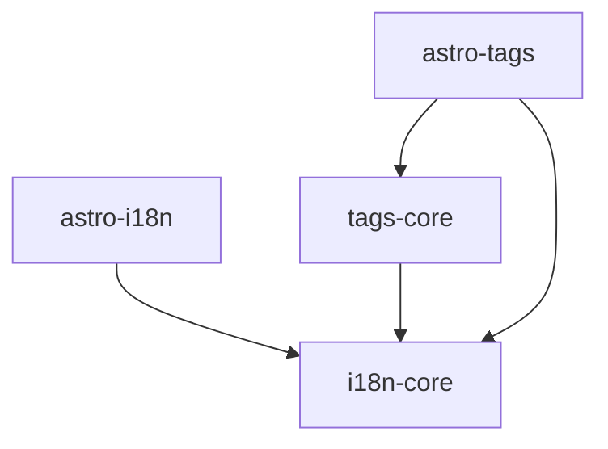

# Package Boundaries

## Purpose

This document defines the architectural boundaries between the
packages of the Secorto ecosystem.

Its purpose is to establish responsibilities, allowed
dependencies and ownership boundaries before implementation
begins.

This document intentionally describes architectural intent
rather than implementation details.

## Package Structure

```text
packages/
├── i18n-core
├── astro-i18n
├── tags-core
└── astro-tags
```

## Architectural Principles

### Domain First

Business concepts belong to core packages.

Framework-specific concerns belong to adapter packages.

### Framework-Agnostic Core

Core packages must not depend on framework APIs.

Core packages should remain usable, testable and portable
without Astro.

### Explicit Dependencies

Package relationships must be intentional and unidirectional.

Circular dependencies are prohibited.

## Package Responsibilities

### i18n-core

The foundational multilingual content package.

Responsible for:

- Translation relationships
- Locale discovery
- Locale validation
- Localized navigation
- Detail route modeling
- Section route modeling
- Content consistency validation

This package represents the multilingual content domain.

#### Allowed Dependencies

None.

#### Forbidden Dependencies

- astro-i18n
- tags-core
- astro-tags
- Astro APIs

---

### astro-i18n

Astro integration package for multilingual content.

Responsible for:

- Astro Content Collection integration
- Astro routing integration
- Astro-specific adapters
- Astro path generation helpers

This package adapts Astro concepts into interfaces required by
`i18n-core`.

#### Allowed Dependencies

- i18n-core

#### Forbidden Dependencies

- tags-core
- astro-tags

---

### tags-core

Framework-agnostic tagging domain.

Responsible for:

- Tag discovery
- Tag indexing
- Tag localization
- Tag validation
- Tag aggregation

Tag functionality is considered a separate concern from
multilingual content.

A multilingual content system may exist without tags.

#### Allowed Dependencies

- i18n-core

#### Forbidden Dependencies

- astro-i18n
- astro-tags

---

### astro-tags

Astro integration package for tag functionality.

Responsible for:

- Tag page generation
- Tag route generation
- Astro-specific tag adapters
- Astro-specific tag helpers

This package adapts Astro concepts into interfaces required by
`tags-core`.

#### Allowed Dependencies

- tags-core
- i18n-core

#### Forbidden Dependencies

None beyond architectural dependency rules.

## Dependency Graph



## Dependency Rules

The following dependency flow is allowed:

```text
Astro Adapters
       ↓

Framework-Agnostic Domains
```

The opposite direction is forbidden.

Core packages must never reference adapter packages.

## Rationale

Different concerns evolve at different rates.

Framework integrations, routing APIs and build tooling may
change over time.

Multilingual content concepts tend to remain more stable.

By separating these concerns, the project gains:

- Better testability
- Clear ownership boundaries
- Improved reuse
- Easier maintenance
- Lower framework coupling

## Related Documents

- [Constitution](../../constitution.md)
- [ADR](../adr/README.md)
